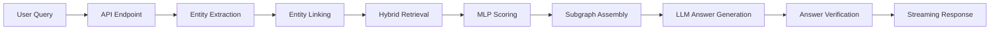
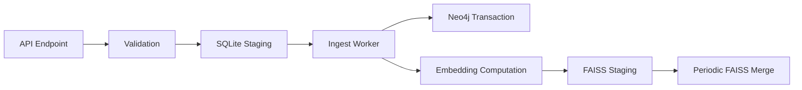

# SubgraphRAG+ Architecture

This document provides a concise overview of the SubgraphRAG+ system architecture, outlining key components and their interactions.

## System Components


### 1. Core Components

| Component | File | Key Functions |
|-----------|------|--------------|
| **API Layer** | `app/api.py` | FastAPI endpoints, SSE streaming, authentication |
| **Data Models** | `app/models.py` | Domain models, request/response validation |
| **Configuration** | `app/config.py` | JSON schema validation, environment variables |
| **Database Layer** | `app/database.py` | Neo4j and SQLite connections, transaction handling |

### 2. Retrieval Components

| Component | File | Key Functions |
|-----------|------|--------------|
| **Retriever** | `app/retriever.py` | Hybrid retrieval, FAISS management, subgraph assembly |
| **Entity Linking** | `app/utils.py` | Query entity extraction, KG linking, fuzzy matching |
| **ML Components** | `app/ml/` | Text embedding, LLM integration, triple scoring |

### 3. Auxiliary Components

| Component | File | Key Functions |
|-----------|------|--------------|
| **Verification** | `app/verify.py` | LLM output validation, citation checking |
| **Scripts** | `scripts/` | Migrations, ingestion workers, FAISS management |

## Data Flow

### 1. Query Processing Flow



### 2. Ingest Flow



## Core Data Structures

### 1. Triple
The fundamental unit of the knowledge graph: (head, relation, tail)

```python
@dataclass
class Triple:
    id: str                # Unique identifier
    head_id: str           # Head entity ID
    head_name: str         # Head entity name
    relation_id: str       # Relation ID
    relation_name: str     # Relation name
    tail_id: str           # Tail entity ID
    tail_name: str         # Tail entity name
    properties: dict       # Additional properties
    embedding: ndarray     # Vector embedding
    relevance_score: float # Relevance to query
```

### 2. GraphData
D3.js compatible visualization structure

```python
@dataclass
class GraphData:
    nodes: List[GraphNode]     # Graph nodes (entities)
    links: List[GraphLink]     # Graph edges (relations)
    relevant_paths: List[Dict] # Multi-hop paths
```

## Performance-Critical Components

| Component | Performance Considerations |
|-----------|----------------------------|
| **Entity Linking** | Query understanding bottleneck |
| **FAISS Search** | Vector search scales with index size |
| **Subgraph Assembly** | Graph algorithms for triple selection |
| **LLM Integration** | API latency or local inference time |

## Storage Architecture

| Storage | Purpose | Key Features |
|---------|---------|--------------|
| **Neo4j** | Knowledge graph | Nodes (entities), relationships, properties, indexes |
| **FAISS** | Vector index | Triple embeddings, semantic search, quantization |
| **SQLite** | Staging & auth | Ingestion queue, API keys, feedback storage |
| **Disk Cache** | Performance | Embedding cache, DDE cache, LRU eviction |

## Key Design Decisions

| Decision | Rationale | Trade-offs |
|----------|-----------|------------|
| **Hybrid Retrieval** | Combines graph traversal precision with vector search recall | Added complexity for better quality |
| **SQLite Staging** | Transactional safety, deduplication, failure resilience | Slight latency increase for reliability |
| **Backend Abstraction** | Support multiple LLM/embedding backends without code changes | Abstraction overhead for flexibility |
| **SSE Streaming** | Token-by-token streaming with typed events | More complex client handling but better UX |

## Scaling & Security

### Scalability 

| Area | Current Capability | Future Extensions |
|------|-------------------|-------------------|
| **Vertical** | FAISS: Millions of triples<br>Neo4j: Tens of millions of nodes | Optimized memory usage<br>Improved query planning |
| **Horizontal** | Limited | Neo4j read replicas<br>Distributed FAISS<br>API load balancing |
| **Bottlenecks** | LLM inference latency<br>FAISS index size<br>Neo4j query complexity | Streaming responses<br>Quantization<br>Query optimization |

### Security

| Feature | Implementation |
|---------|---------------|
| **Authentication** | API key-based with environment variable storage |
| **Protection** | Input validation, LLM output verification, rate limiting |
| **Monitoring** | Logging, Prometheus metrics, health/readiness probes |

## Future Extensions

| Area | Planned Features |
|------|-----------------|
| **Multitenancy** | Tenant isolation, dedicated indices, key mapping |
| **Monitoring** | Request tracing, performance profiling, alerting |
| **Learning** | Feedback-driven fine-tuning, evaluation pipeline |

The modular architecture provides a solid foundation while enabling future extensions for scaling, security, and continuous improvement.