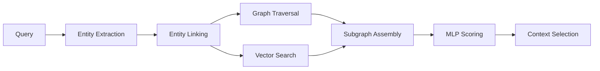
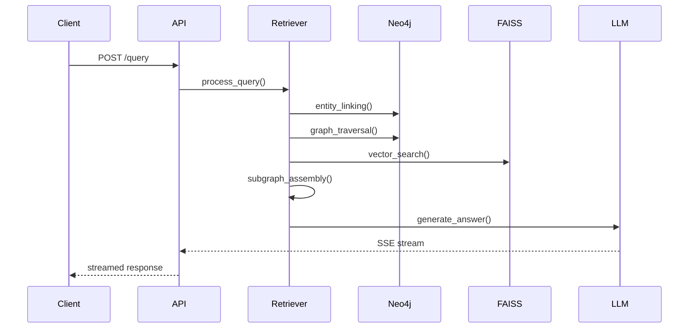
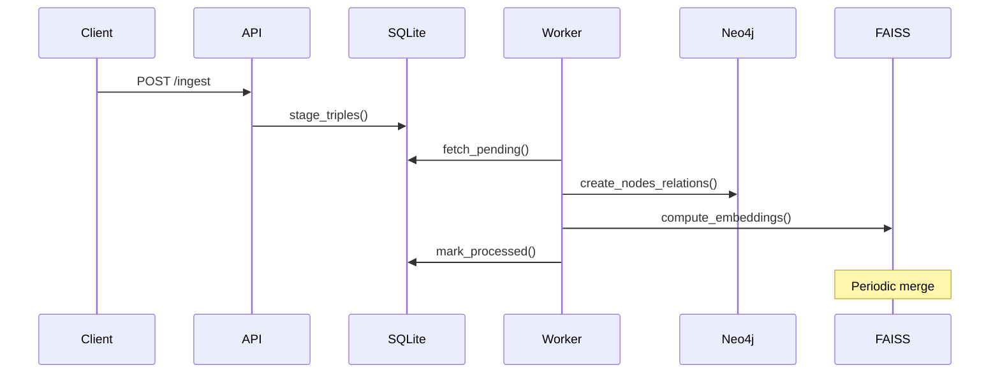

# SubgraphRAG+ Architecture

This document provides a detailed technical overview of the SubgraphRAG+ system architecture, focusing on component interactions, data flow, and design decisions.

## System Overview

SubgraphRAG+ implements a hybrid retrieval architecture that combines graph traversal with vector search to provide accurate, contextual answers with explanatory visualizations.


## Core Components

### 1. API Layer (`src/app/api.py`)
- **FastAPI endpoints** with OpenAPI documentation
- **SSE streaming** for real-time response delivery
- **Authentication** via API keys
- **Rate limiting** and request validation
- **Health/readiness probes** for monitoring

### 2. Data Models (`src/app/models.py`)
- **Pydantic models** for request/response validation
- **Domain objects** (Triple, GraphData, QueryRequest)
- **Type safety** and automatic serialization
- **JSON schema** generation for API docs

### 3. Configuration Management (`src/app/config.py`)
- **JSON schema validation** for config files
- **Environment variable** handling
- **Backend abstraction** for different LLM providers
- **Runtime configuration** updates

### 4. Database Layer (`src/app/database.py`)
- **Neo4j connection** management with connection pooling
- **SQLite staging** for ingestion queue and auth
- **Transaction handling** with rollback support
- **Connection health monitoring**

## Retrieval Architecture

### 1. Hybrid Retriever (`src/app/retriever.py`)
The core retrieval engine implements a two-stage process:



**Stage 1: Candidate Retrieval**
- **Entity extraction** from natural language queries
- **Fuzzy matching** to link entities to knowledge graph
- **Graph traversal** using Neo4j Cypher queries
- **Vector search** using FAISS for semantic similarity

**Stage 2: Relevance Scoring**
- **MLP scoring model** for triple relevance
- **Subgraph assembly** with path-based ranking
- **Context window optimization** within token budget

### 2. Entity Linking (`src/app/utils.py`)
- **Named entity recognition** using spaCy
- **Fuzzy string matching** with configurable thresholds
- **Graph-based disambiguation** using node connectivity
- **Caching** for frequent entity lookups

### 3. ML Components (`src/app/ml/`)
- **Text embedding** with multiple backend support
- **LLM integration** (OpenAI, HuggingFace, MLX)
- **Triple scoring** with pre-trained MLP models
- **Batch processing** for efficiency

## Data Flow Architecture

### Query Processing Pipeline



### Ingestion Pipeline



## Storage Architecture

### 1. Neo4j Knowledge Graph
- **Nodes**: Entities with properties and labels
- **Relationships**: Typed connections between entities
- **Indexes**: Optimized for entity name lookups
- **Constraints**: Ensure data integrity

```cypher
// Example schema
CREATE CONSTRAINT entity_id IF NOT EXISTS FOR (e:Entity) REQUIRE e.id IS UNIQUE;
CREATE INDEX entity_name IF NOT EXISTS FOR (e:Entity) ON (e.name);
CREATE INDEX relation_type IF NOT EXISTS FOR ()-[r:RELATION]-() ON (r.type);
```

### 2. FAISS Vector Index
- **Triple embeddings** for semantic search
- **Quantization** for memory efficiency
- **Staging area** for incremental updates
- **Periodic merging** to maintain performance

### 3. SQLite Staging Database
- **Ingestion queue** with status tracking
- **API key management** with rate limiting
- **Error logging** for failed operations
- **Feedback storage** for model improvement

## Performance Optimizations

### 1. Caching Strategy
- **Entity linking cache** (LRU eviction)
- **DDE feature cache** for graph patterns
- **Embedding cache** for computed vectors
- **Query result cache** for frequent patterns

### 2. Indexing Strategy
- **Neo4j indexes** on entity names and IDs
- **FAISS quantization** for large-scale vector search
- **SQLite indexes** on staging table status
- **Composite indexes** for complex queries

### 3. Concurrency Model
- **Async/await** for I/O operations
- **Connection pooling** for database connections
- **Background workers** for ingestion processing
- **Rate limiting** to prevent resource exhaustion

## Scalability Considerations

### Current Capabilities
- **FAISS**: Millions of triples with quantization
- **Neo4j**: Tens of millions of nodes/relationships
- **Concurrent users**: Limited by LLM backend latency
- **Ingestion rate**: ~1000 triples/second

### Scaling Strategies
- **Horizontal scaling**: Neo4j read replicas
- **Distributed FAISS**: Sharded vector indexes
- **API load balancing**: Multiple service instances
- **Caching layers**: Redis for shared state

## Security Architecture

### 1. Authentication & Authorization
- **API key-based** authentication
- **Environment variable** storage for secrets
- **Rate limiting** per API key
- **Request validation** with Pydantic

### 2. Input Validation
- **Schema validation** for all inputs
- **SQL injection prevention** via parameterized queries
- **XSS protection** in API responses
- **File upload restrictions** for ingestion

### 3. Monitoring & Logging
- **Structured logging** with correlation IDs
- **Health checks** for all dependencies
- **Metrics collection** for performance monitoring
- **Error tracking** with stack traces

## Extension Points

### 1. Backend Abstraction
The system supports multiple backends through a common interface:

```python
class LLMBackend(ABC):
    @abstractmethod
    async def generate(self, prompt: str, **kwargs) -> AsyncIterator[str]:
        pass
    
    @abstractmethod
    async def embed(self, texts: List[str]) -> np.ndarray:
        pass
```

### 2. Plugin Architecture
- **Custom retrievers** via inheritance
- **Additional data sources** through adapters
- **Custom scoring models** with standardized interfaces
- **Visualization backends** for different frontends

### 3. Future Enhancements
- **Multi-tenant isolation** with namespace support
- **Federated search** across multiple knowledge graphs
- **Real-time learning** from user feedback
- **Advanced reasoning** with symbolic AI integration

This modular architecture enables incremental improvements while maintaining system stability and performance.

## Frontend Architecture

### Next.js Web Interface

SubgraphRAG+ includes a modern **Next.js 15** frontend with **shadcn/ui** components for interactive knowledge graph exploration and chat-based querying.

**Key Components:**
- **Chat Interface** (`chat-support.tsx`): Real-time conversation with SSE streaming
- **Graph Visualization** (`data-table.tsx`): Interactive knowledge graph browser
- **Navigation** (`app-sidebar.tsx`): Application navigation and user management
- **Analytics Dashboard** (`chart-area-interactive.tsx`): Performance metrics and insights

**Technology Stack:**
- **Next.js 15**: React framework with App Router
- **React 19**: Latest React features and concurrent rendering
- **shadcn/ui**: Modern, accessible UI component library
- **Tailwind CSS**: Utility-first CSS framework
- **TypeScript**: Type-safe development

**API Integration:**
```typescript
// Example API integration
const response = await fetch('/api/query', {
  method: 'POST',
  headers: {
    'Content-Type': 'application/json',
    'X-API-Key': process.env.NEXT_PUBLIC_API_KEY
  },
  body: JSON.stringify({ question: userInput })
});

// Handle SSE streaming
const reader = response.body?.getReader();
const decoder = new TextDecoder();
```

**Real-time Features:**
- **Server-Sent Events (SSE)**: Live streaming of query responses
- **Progressive Loading**: Incremental content rendering
- **Graph Updates**: Real-time visualization of retrieved subgraphs
- **Chat History**: Persistent conversation state

**Deployment Options:**
- **Vercel**: Recommended for production deployment
- **Docker**: Containerized deployment with backend
- **Static Export**: Pre-built static files for CDN hosting
- **Self-hosted**: Node.js server deployment

## Information Extraction & Entity Typing

### REBEL IE Service

SubgraphRAG+ includes a dedicated Information Extraction (IE) service using **Babelscape/rebel-large** for proper triple extraction from raw text. This replaces naive string heuristics with production-grade relation extraction.

**Key Features:**
- **Open-schema extraction**: Discovers arbitrary relations without predefined schemas
- **High precision**: REBEL achieves 85-90% precision/recall on general text
- **Scalable**: ~200ms per text chunk on CPU, ~50ms on GPU
- **Offline operation**: No external API dependencies

**Architecture:**
```
Raw Text → REBEL IE Service → Structured Triples → Staging → Neo4j + FAISS
```

**API Endpoints:**
- `POST /extract`: Extract triples from text
- `GET /health`: Service health check
- `GET /info`: Model information

### Schema-Driven Entity Typing

The system uses **schema-driven entity typing** instead of brittle string heuristics:

1. **External Type Mappings**: Load entity→type mappings from JSON/CSV files
2. **Pattern-Based Fallback**: Comprehensive patterns for Biblical/domain entities
3. **Context Disambiguation**: Use surrounding text for ambiguous entities
4. **Caching**: LRU cache for performance (10,000 entities)

**Type Hierarchy:**
- `Person`: Biblical figures, historical persons, titles
- `Location`: Places, geographical features, cities
- `Organization`: Tribes, groups, institutions
- `Event`: Historical events, religious observances
- `Concept`: Abstract concepts, laws, teachings
- `Entity`: Default fallback type

**Configuration:**
```json
{
  "Moses": "Person",
  "Jerusalem": "Location", 
  "Israelites": "Organization",
  "Exodus": "Event",
  "Covenant": "Concept"
}
```

### Integration with Original SubgraphRAG

The enhanced pipeline maintains **full compatibility** with the original SubgraphRAG MLP model:

1. **Triple Extraction**: REBEL → structured triples
2. **Entity Typing**: Schema-driven → proper type annotations  
3. **Embedding**: Same embedding model → compatible vectors
4. **MLP Scoring**: Original pretrained model → no retraining needed
5. **Retrieval**: Hybrid graph + dense → same algorithm

This ensures **zero retraining cost** while dramatically improving extraction quality and domain adaptability.