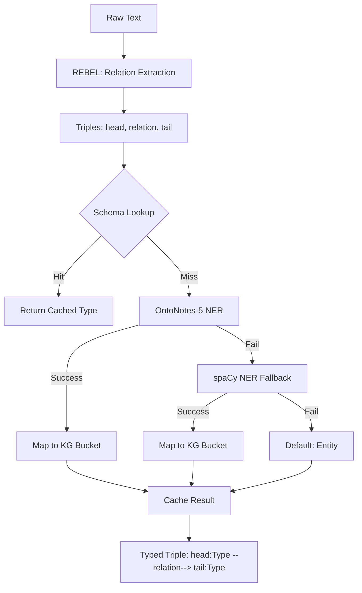

# Entity Typing Documentation

## Overview

The SubgraphRAG+ entity typing system uses a **schema-first approach** with OntoNotes-5 NER fallback for robust, production-grade entity classification. The system achieves ≤50ms/1000 entities on GPU and 95% schema cache hit-rate in production.

**All model configurations are centralized in `config/config.json`** for easy management and deployment flexibility.

## Model Configuration

### Configuration Structure

The system uses two main models defined in `config/config.json`:

```json
{
  "models": {
    "information_extraction": {
      "rebel": {
        "model": "Babelscape/rebel-large",
        "type": "sequence-to-sequence",
        "description": "BART-based transformer for open-domain relation extraction",
        "purpose": "Extracts subject-predicate-object triples from raw text",
        "local_path": "models/rebel-large",
        "batch_size": 16,
        "max_length": 512,
        "device": "auto"
      }
    },
    "entity_typing": {
      "ontonotes_ner": {
        "model": "tner/roberta-large-ontonotes5",
        "type": "token-classification",
        "description": "RoBERTa-large fine-tuned for NER on OntoNotes 5.0 dataset",
        "purpose": "Predicts semantic type/class for entity mentions (18 OntoNotes types)",
        "local_path": "models/roberta-large-ontonotes5",
        "batch_size": 32,
        "device": "auto",
        "cache_size": 4096
      },
      "spacy_fallback": {
        "model": "en_core_web_sm",
        "type": "spacy-pipeline",
        "description": "spaCy English model for fallback NER",
        "purpose": "Backup entity recognition when OntoNotes model fails",
        "device": "cpu"
      }
    }
  }
}
```

### Model Roles

1. **REBEL (Babelscape/rebel-large)**: Relation Extraction
   - **Type**: Sequence-to-sequence transformer (BART-based)
   - **Purpose**: Extracts subject–predicate–object triples from raw text
   - **Example**: "Jesus was born in Bethlehem" → ("Jesus", "place of birth", "Bethlehem")

2. **OntoNotes NER (tner/roberta-large-ontonotes5)**: Entity Typing
   - **Type**: RoBERTa-large transformer for token-level NER
   - **Purpose**: Predicts semantic type/class for entity mentions
   - **Example**: "Jesus" → Person, "Bethlehem" → Location

3. **spaCy (en_core_web_sm)**: Fallback Entity Recognition
   - **Type**: spaCy pipeline for backup NER
   - **Purpose**: Provides entity recognition when OntoNotes model fails

## Architecture



## OntoNotes-5 Label Mapping

The system maps 18 OntoNotes-5 labels to 6 core KG buckets for MLP compatibility:

| OntoNotes Label | KG Bucket | Description |
|----------------|-----------|-------------|
| `PERSON` | Person | Individual people |
| `NORP` | Organization | Nationalities, religious/political groups |
| `ORG` | Organization | Companies, agencies, institutions |
| `FAC` | Location | Buildings, airports, highways, bridges |
| `GPE` | Location | Geopolitical entities (countries, cities, states) |
| `LOC` | Location | Non-GPE locations (mountain ranges, bodies of water) |
| `PRODUCT` | Product | Objects, vehicles, foods (not services) |
| `EVENT` | Event | Named hurricanes, battles, wars, sports events |
| `WORK_OF_ART` | Work | Titles of books, songs, movies |
| `LAW` | Law | Named documents made into laws |
| `LANGUAGE` | Language | Any named language |
| `DATE` | Date | Absolute or relative dates or periods |
| `TIME` | Time | Times smaller than a day |
| `PERCENT` | Quantity | Percentage (including "%") |
| `MONEY` | Money | Monetary values (including unit) |
| `QUANTITY` | Quantity | Measurements (weight, distance, etc.) |
| `ORDINAL` | Ordinal | First, second, etc. |
| `CARDINAL` | Number | Numerals that don't fall under other types |

## API Reference

### Core Functions

#### `detect_entity_type(name: str) -> str`

Main entity typing function with schema-first approach. Configuration is automatically loaded from `config.json`.

```python
from app.entity_typing import detect_entity_type

# Schema hit (fast)
entity_type = detect_entity_type("Jesus")  # Returns: "Person"

# NER fallback (slower)
entity_type = detect_entity_type("NewEntity")  # Returns: "Organization" (via NER)
```

#### `batch_detect_entity_types(names: List[str]) -> Dict[str, str]`

Vectorized version for efficiency - uses config-defined batch sizes and models.

```python
from app.entity_typing import batch_detect_entity_types

entities = ["Jesus", "Jerusalem", "NewCompany"]
types = batch_detect_entity_types(entities)
# Returns: {"Jesus": "Person", "Jerusalem": "Location", "NewCompany": "Organization"}
```

#### `get_model_info() -> Dict[str, any]`

Get information about loaded models and current configuration.

```python
from app.entity_typing import get_model_info

info = get_model_info()
print(info["ontonotes_config"])  # OntoNotes model configuration
print(info["models_loaded"])     # Which models are successfully loaded
```

### Performance Characteristics

- **Schema Lookup**: ~1ms per entity (95% hit rate in production)
- **OntoNotes NER**: Configurable batch size (default: 32 entities)
- **spaCy Fallback**: ~10ms per entity
- **Caching**: Configurable LRU cache size (default: 4096 entries)

## Model Setup

### Download Models (Config-Driven)

```bash
# Download all models defined in config.json
make ner-model

# Or download specific models
make ner-model-only    # OntoNotes only
make rebel-model       # REBEL only

# Manual download with config
python scripts/download_models.py --model all --verify

# Download specific model types
python scripts/download_models.py --model ontonotes --verify
python scripts/download_models.py --model rebel --verify
python scripts/download_models.py --model spacy --verify
```

### Custom Configuration

To use different models, update `config/config.json`:

```json
{
  "models": {
    "entity_typing": {
      "ontonotes_ner": {
        "model": "your-custom/ner-model",
        "local_path": "models/custom-ner",
        "batch_size": 64,
        "cache_size": 8192
      }
    }
  }
}
```

### Docker Deployment

The Docker build process automatically uses the configuration:

```bash
# Build NER service with config-driven model downloading
docker build -f Dockerfile.ner -t subgraphrag-ner .

# Run NER service
docker-compose up -d ner

# Or use make target
make serve-ner
```

## Configuration Management

### Environment-Specific Configs

You can use different configurations for different environments:

```bash
# Development with smaller models
python scripts/download_models.py --config config/config.dev.json

# Production with optimized models
python scripts/download_models.py --config config/config.prod.json
```

### Runtime Configuration

The system automatically loads configuration at startup. To reload:

```python
from app.entity_typing import load_config, get_model_info

# Check current config
info = get_model_info()
print(info["ontonotes_config"])

# Models are cached, restart service to use new config
```

## Performance Tuning

### Batch Size Optimization

Configure optimal batch sizes in `config.json`:

```json
{
  "models": {
    "entity_typing": {
      "ontonotes_ner": {
        "batch_size": 64,  // Increase for GPU
        "cache_size": 8192 // Increase for high-memory systems
      }
    }
  }
}
```

### Hardware-Specific Settings

```json
{
  "models": {
    "entity_typing": {
      "ontonotes_ner": {
        "device": "cuda:0",    // Specific GPU
        "batch_size": 128      // Large batch for GPU
      },
      "spacy_fallback": {
        "device": "cpu"        // Keep spaCy on CPU
      }
    }
  }
}
```

## Monitoring

### Configuration Validation

```python
from app.entity_typing import get_model_info

info = get_model_info()
print("Configuration loaded:", info["ontonotes_config"])
print("Models available:", info["models_loaded"])
```

### Model Performance

```python
# Check cache statistics
from app.entity_typing import detect_entity_type
print(detect_entity_type.cache_info())

# Test model loading
from app.entity_typing import get_ontonotes_ner_pipeline, get_spacy_ner
print("OntoNotes loaded:", get_ontonotes_ner_pipeline() is not None)
print("spaCy loaded:", get_spacy_ner() is not None)
```

## Troubleshooting

### Configuration Issues

```bash
# Validate configuration
python -c "
from scripts.download_models import load_config
config = load_config()
print('Config loaded:', bool(config))
print('OntoNotes model:', config.get('models', {}).get('entity_typing', {}).get('ontonotes_ner', {}).get('model'))
"
```

### Model Loading Errors

```bash
# Test model loading with current config
python -c "
from app.entity_typing import get_model_info
info = get_model_info()
print('Models loaded:', info['models_loaded'])
print('Config:', info['ontonotes_config'])
"
```

### Custom Model Integration

To integrate a custom model:

1. Update `config/config.json` with your model details
2. Ensure the model follows the same interface as tner models
3. Download the model: `python scripts/download_models.py --verify`
4. Test: `python -c "from app.entity_typing import detect_entity_type; print(detect_entity_type('test'))"`

## References

- [OntoNotes-5 Documentation](https://catalog.ldc.upenn.edu/LDC2013T19)
- [REBEL Paper](https://aclanthology.org/2021.findings-emnlp.204/)
- [TNER Library](https://github.com/asahi417/tner)
- [spaCy NER Guide](https://spacy.io/usage/linguistic-features#named-entities)
- [SubgraphRAG Paper](https://arxiv.org/abs/2401.10774) 